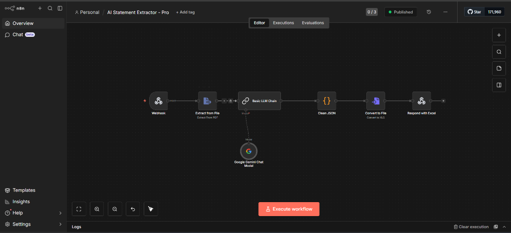

# AI Bank Statement Extractor 🚀

Transform your bank statements (PDF/Images) into structured Excel files using **n8n** and **Google Gemini AI**.

## ✨ Features

- **AI Powered:** Uses Gemini 1.5 Flash to intelligently extract transaction data.
- **Automated:** Simple drag-and-drop frontend interface.
- **Format Support:** Works with PDFs and Image-based statements.
- **Ready to Go:** Exports directly to `.xlsx` format.

## 🛠️ Setup Instructions

### 1. n8n Configuration

1. Install [n8n](https://n8n.io/) locally or use the Desktop app.
2. Import the `workflow_final.json` file provided in this repository.
3. Add your **Google Gemini API Key** to the Gemini node credentials.
4. Ensure the Webhook node path is set to `extract-statement`.
5. **Publish** the workflow.

### 2. Frontend Setup

1. Open `frontend/index.html` in your browser.
2. Ensure n8n is running at `http://localhost:5678`.
3. Drop your bank statement and click **Start AI Extraction**.

## 📁 Repository Structure

- `/frontend`: Modern glassmorphism UI for file uploads.
- `workflow_final.json`: The complete n8n workflow export.
- `assets/`: Project screenshots and documentation assets.

## 🚀 One-Click Workflow

Import `workflow_final.json` into your n8n instance to get started immediately!
